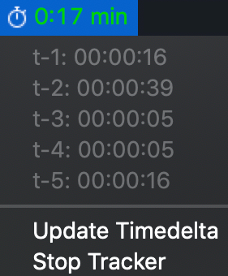
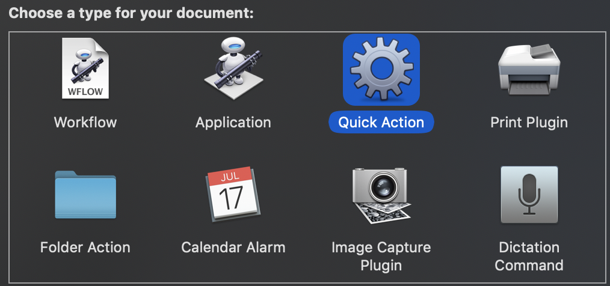
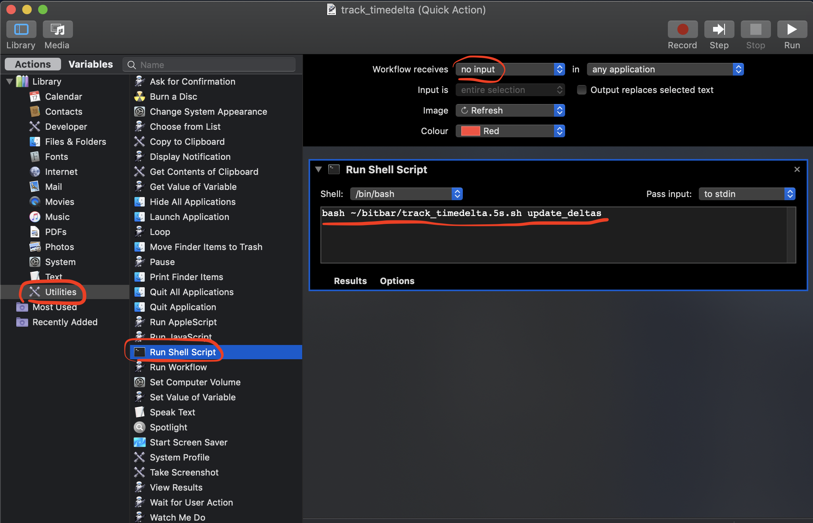
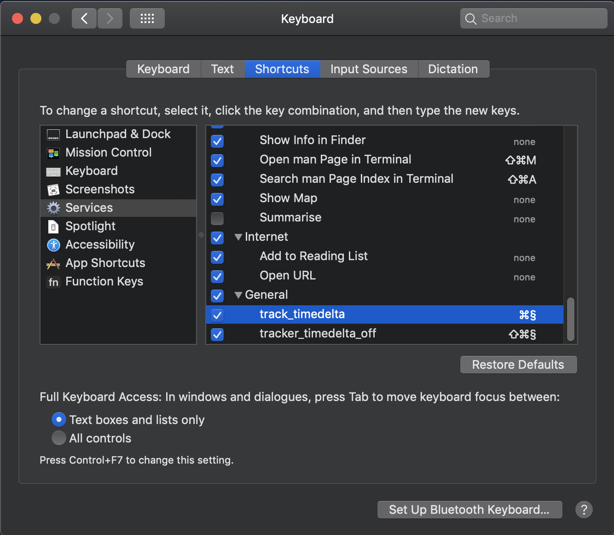

# xbar Deltatime Tracker

[](https://github.com/miykael/xbar_deltatime_tracker/archive/master.zip)

This repository contains a script that can help to keep track of the time passed between two events. Everything relevant to do this is stored in the file `track_timedelta.5s.sh`. The recommended way to use this script is to combine it with [xbar](https://github.com/matryer/xbar), an application for Mac OS X which allows the printing of output directly into the menu bar.


## Purpose

The purpose of the timedelta tracker script is rather simple, to track the time between two terminal commands or if setup correctly two keyboard shortcut presses.

The application has **four different states**:

- **Idle state** - : When the script isn't tracking, the output in the menu bar is ∞.
- **Green state** - :  While the tracking time is in the first period (by default between 0 to 30min), the time is shown in green.
- **Yellow state** - :  While the tracking time is in the second period (by default between 30 to 45min), the time is shown in yellow.
- **Red state** - :  Once the tracking time is in the third and last period (by default after 45min), the time is shown in red.

Additionally to these four states, timedelta tracker also keeps a log of the last 6 (default) timedelta it computed. This log can be accessed by clicking on the xbar section of timedelta in the menubar, and it looks as follows:




## Configuration

Adaptations of the timedelta tracker script can be done directly in the script `track_timedelta.5s.sh`.

You can change the thresholds for the color switch between green and yellow (i.e. `YELLOWSWITCH`) and yellow and red (i.e. `REDSWITCH`).

```bash
# Define duration (in seconds) for color switches
YELLOWSWITCH=$((30*60))
REDSWITCH=$((45*60))

# Maximum lenght of tracks
NMAX=6
```

Additionally, you can also changing the time interval in which the script updates the output of the script by chaning the second part of the file name `track_timedelta.5s.sh`, i.e. the string `5s`. By default the script is updated every 5 seconds, however a smaller or bigger time interval chan be chosen if desired.


## Installation

The easiest way to run this script in the background is to use the [xbar](https://github.com/matryer/xbar) application. As this application is restricted to Mac OS X, the installation here is restricted to this OS, however the script `track_timedelta.5s.sh` should run on any OS which supports bash.

The following instruction are focused on how to make this script run on a Mac OS X using the xbar application:

1. Install xbar application as described [here](https://github.com/matryer/xbar#installing-xbar), either via the terminal or by installing it as an application.
2. Create a plugin folder to store xbar scripts, in our case this is under `~/xbar` or `/Users/username/xbar`.
3. Download script `track_timedelta.5s.sh` from this repository and store it in the xbar plugin folder mentioned in the previous point.

## Usage via Keyboard Shurtcuts

Once the script is stored in the xbar plugin folder and xbar is refreshed, than the script can be used via the dropdown menu. However, the recommended way to use this script is by assigning keyboar shortcuts which allow to **(1) restart/update the timer** or **(2) stop the timer** and set it back to idle status.

The quickest way to get this done on a Mac OS X, is via the application **Automator**. The steps are as follows:

1. Open **Automator** application and create a new file (either via the menubar "File > New" or directly with the `⌘N` shortcut).
2. As document type, select **Quick Action**:  
   
3. As shown in the image below: First, select **Utilities** on the right. Second, select **Run Shell Script** and drag and drop it to the right part of the window. Third, select **no input** in the **Workflow receives** dropdown menu. Fourth, add the bash command to update the timedeltas, starting with the path to the script `track_timedelta.5s.sh`. In our case this bash command is `bash ~/xbar/track_timedelta.5s.sh update_deltas`  
   
4. Save this automator script under a name, e.g. `track_timedelta`.
5. Redo point 3. but this time replace `update_deltas` in the bash command with `tracker_off` and store this new automator script under a seocnd name, e.g. `track_timedelta_off`.

As a last step, you'll need to assign keyboard shortcuts to these quick action automator scripts. You can do this by going to the keyboard settings, selecting the **Shortcuts** tab, selecting the **Services** section on the left, scrolling down to the **General** section on the right and assigning two unique keyboard shortcuts to `track_timedelta` and  `track_timedelta_off`.



I can recommend the shortcuts `⌘§` to update/start the timedelta tracking and `SHIFT+⌘§` to stop it.

Once this is all done, you should be good to go!
